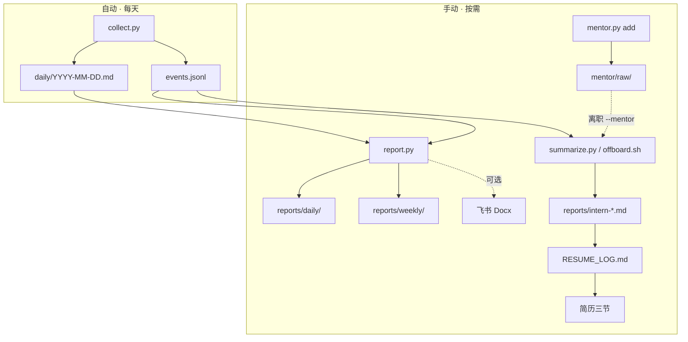

<div align="center">

# resume-journal

**把飞书协作、Agent 会话、Git 提交，自动沉淀成日报、周报与简历素材。**

本地运行 · 不上传云端 · 不需要 API Key

<br />

[](LICENSE)


[快速开始](#快速开始) · [日报周报](#日报--周报) · [导师蒸馏](#导师蒸馏) · [离职汇总](#离职汇总) · [配置](#配置) · [FAQ](#常见问题)

</div>

<br />

## 这是什么

实习生的工作散落在三处：**飞书**（会议、任务、文档）、**Agent**（Claude / Codex / Cursor）、**Git**（交付 commit）。  
本项目把它们串成一条流水线——自动采集、按需汇报、离职成稿。

| | 自动 | 手动 | 产出 |
|---|:---:|:---:|---|
| **每日记录** | ✓ | | `daily/` · `events.jsonl` |
| **日报 / 周报** | | ✓ | `reports/daily/` · `reports/weekly/` · 可选飞书 Docx |
| **导师蒸馏** | | ✓ | `mentor/` → 离职汇总时合并进简历 |
| **简历汇总** | | ✓ | `reports/intern-*.md` → `RESUME_LOG.md` |

> **命名对照** — 仓库 `resume-journal` · Skill 包 `intern.skill` · 数据目录 `~/.实习生-skill/`（旧路径 `~/.resume-journal` 安装时自动软链）

<br />

## 快速开始

```bash
git clone https://github.com/Orange-master/intern.skill.git resume-journal
cd resume-journal

bash scripts/install.sh          # 安装 Skill + 创建数据目录
python3 scripts/setup_role.py    # 选择岗位
bash scripts/setup-feishu.sh     # 飞书授权 + 首次采集
```

编辑 `~/.实习生-skill/config.json`，至少配置 `repos`（Git 仓库路径）和 `reports.subject`（汇报署名）。

之后系统会在**下班前 30 分钟**自动采集（可在 `schedule` 中调整）。

<br />

## 工作流



<br />

## 日常使用

### 看今天干了什么

```bash
cat ~/.实习生-skill/daily/$(date +%Y-%m-%d).md
bash scripts/today.sh              # 补采 + 打印
```

### 日报 / 周报

```bash
# 本地 Markdown
bash scripts/daily_report.sh
bash scripts/weekly_report.sh

# 同步发布飞书文档
PUBLISH=1 bash scripts/daily_report.sh
PUBLISH=1 bash scripts/weekly_report.sh
```

<details>
<summary><strong>高级用法</strong> — 指定日期、署名、仅发飞书</summary>

<br />

```bash
# 环境变量（daily_report.sh / weekly_report.sh 通用）
DATE=2026-07-01 SUBJECT=张三 PUBLISH=1 bash scripts/daily_report.sh

# 直接调用 report.py
python3 scripts/report.py daily   --collect-first --publish-feishu
python3 scripts/report.py weekly  --date 2026-07-08 --subject 张三
python3 scripts/report.py daily   --publish-feishu --no-save   # 只发飞书，不写本地
```

| 变量 / 参数 | 默认 | 说明 |
|---|---|---|
| `JOURNAL` | `~/.实习生-skill` | 数据目录 |
| `DATE` | 今天 | 锚定日期 |
| `SUBJECT` | config 中的署名 | 报告标题 |
| `COLLECT` | `1` | 生成前先采集 |
| `PUBLISH` | `0` | `1` = 创建飞书 Docx |
| `--output` | 自动路径 | 自定义输出文件 |

产出路径：

```
~/.实习生-skill/reports/daily/daily-YYYY-MM-DD.md
~/.实习生-skill/reports/weekly/weekly-YYYY-MM-DD.md   # 文件名取周一
```

</details>

### 导师蒸馏

实习生的 dirty work 往往分散在 commit 和会话里，**项目背景、指标、架构** 却在 mentor 的飞书文档中。  
导师蒸馏把 mentor/正式员工的文档改写成**第一人称**简历素材，离职汇总时与你的真实信号交叉验证后合并。

**平时积累**（实习期间随时导入，汇总时才用）：

```bash
# 从飞书文档导入
python3 scripts/mentor.py add --project "TikTok GMV 排查" --feishu "https://xxx.feishu.cn/docx/..."

# 从本地文件导入
python3 scripts/mentor.py add --project "数据平台重构" --file ~/Downloads/design.md

# 查看已导入项目
python3 scripts/mentor.py list

# 扫描 mentor/inbox/ 目录（丢 .md/.txt 后一键导入）
python3 scripts/mentor.py inbox
```

**离职汇总时自动合并**（`offboard.sh` 内部带 `--mentor`）：

```bash
bash scripts/offboard.sh "你的名字"
# 等价于 summarize.py --days 90 --mentor
```

也可单独生成蒸馏稿预览：

```bash
python3 scripts/mentor.py distill --subject "你的名字" --days 30
# → reports/mentor-distill-你的名字.md
```

> **注意** — 蒸馏只改语气，不编造事实。写入简历前必须对照自己的 Git commit / Agent 会话核对，不确定标 `[待核实]`。  
> 精细规则见 Agent skill **`intern-mentor-distill`**。

### 离职汇总

```bash
bash scripts/offboard.sh "你的名字"
```

然后在 Agent 中说：

> 读 `reports/intern-*.md` 和 `RESUME_LOG.md`，按职责、产出、项目经历三节写简历。不确定标 `[待核实]`。

<br />

## 输出格式

<table>
<tr>
<th width="50%">日报 / 周报 <code>report.py</code></th>
<th width="50%">简历 <code>summarize.py</code></th>
</tr>
<tr>
<td valign="top">

**日报**  
今日完成 · 会议与协作 · 代码与交付 · Agent 摘要 · 文档沉淀 · 明日计划 · 风险与阻塞

**周报**  
本周概览 · 关键产出 · 会议与协作 · 代码与交付 · 文档沉淀 · 每日摘要 · 下周计划 · 风险与阻塞

</td>
<td valign="top">

```markdown
## 职责
- 岗位级概括（2–4 条）

## 产出
- 量化或可验证交付（2–5 条）

## 项目经历
### {项目名}
- **背景** · **负责** · **产出** · **技术栈**
```

</td>
</tr>
</table>

<br />

## 配置

配置文件：`~/.实习生-skill/config.json`

```json
{
  "journal_dir": "~/.实习生-skill",
  "role": { "preset": "frontend", "title": "前端开发实习生" },
  "schedule": { "work_end": "18:00", "collect_before_minutes": 30 },
  "repos": [{ "path": "~/Projects/my-app", "label": "My App" }],
  "feishu": {
    "enabled": true,
    "calendar": { "enabled": true },
    "tasks": { "enabled": true },
    "messages": { "enabled": true, "work_only": true },
    "docs": { "enabled": true, "mine": true }
  },
  "reports": {
    "subject": "张三",
    "feishu": {
      "parent_token": "",
      "parent_position": "my_library"
    }
  },
  "mentor": {
    "distill_voice": "intern_first",
    "align_with_signals": true
  }
}
```

<details>
<summary><strong>配置项说明</strong></summary>

<br />

| 配置块 | 作用 |
|---|---|
| `journal_dir` | 数据目录 |
| `schedule` | 下班时间，提前 N 分钟自动采集 |
| `role` | 岗位 preset，影响采集侧重点与报告署名 |
| `repos` | Git 仓库列表（**必填**） |
| `feishu.*` | 飞书日程 / 任务 / 消息 / 文档 |
| `reports.*` | 日报周报署名与飞书文档存放位置 |
| `mentor.*` | 导师蒸馏语气（`intern_first`）与信号对齐 |
| `sources.*` | Claude / Codex / Cursor 会话开关 |
| `domains` | 补充岗位关键词（可选） |

`reports.feishu.parent_token` 填云盘文件夹 token 时优先生效；留空则写入个人知识库 `my_library`。

</details>

<br />

## 数据目录

```
~/.实习生-skill/
├── config.json              用户配置
├── events.jsonl             原始事件流
├── state.json               增量游标
├── daily/                   ★ 每日摘要（实习期间主要看这个）
├── reports/
│   ├── daily/               日报 Markdown
│   ├── weekly/              周报 Markdown
│   └── intern-*.md          离职汇总草稿
├── RESUME_LOG.md            简历素材库
├── mentor/                  导师文档（蒸馏素材）
│   ├── raw/                 原始文档
│   ├── inbox/               拖入 .md/.txt 后 mentor.py inbox 导入
│   └── index.json           项目索引
└── logs/                    定时采集日志
```

<br />

## 推荐节奏

| 时机 | 动作 |
|---|---|
| 安装后 | `setup_role.py` → 配 `repos` → `setup-feishu.sh` |
| 实习期间 | 自动采集；偶尔看 `daily/今天.md`；有 mentor 文档就 `mentor.py add` |
| 每天下班 | `daily_report.sh`（或 `PUBLISH=1` 发飞书） |
| 每周五 | `weekly_report.sh` |
| 快离职 | 确认 mentor 已导入 → `offboard.sh` → Agent 写简历三节 |

<br />

## 在 Agent 里怎么说

| 你说 | Agent 做 |
|---|---|
| 「今天干了什么」 | 读 `daily/`，复述，不汇总 |
| 「写日报 / 周报 / 发飞书汇报」 | 跑 `report.py`，可选 `--publish-feishu` |
| 「写简历 / 离职汇总」 | 跑 `offboard.sh`，按三节输出 |
| 「蒸馏 mentor 文档」 | `mentor.py add/distill`，汇总时 `--mentor` 自动合并 |

<br />

<details>
<summary><strong>安装细节</strong></summary>

<br />

**环境要求**

| 依赖 | 用途 |
|---|---|
| Python 3 | 脚本运行时（标准库） |
| lark-cli | 飞书采集 + 文档创建 |
| Claude Code / Codex | 离职时 Agent 精炼简历 |
| Git | 追踪 commit |
| macOS（可选） | `schedule.work_end` 定时采集 |

**安装选项**

```bash
INSTALL_TARGETS=claude,codex,cursor bash scripts/install.sh   # 同时链接 Cursor Skill
INSTALL_CRON=0 bash scripts/install.sh                        # 不注册定时任务
INSTALL_CRON=1 bash scripts/install.sh                        # 刷新定时任务
```

**项目结构**

```
resume-journal/
├── SKILL.md · README.md · config.example.json
└── scripts/
    ├── collect.py · lark_collect.py      采集
    ├── report.py                         日报 / 周报
    ├── daily_report.sh · weekly_report.sh
    ├── summarize.py · offboard.sh        简历汇总
    ├── mentor.py · mentor_distill.py     导师蒸馏
    ├── install.sh · setup-feishu.sh · setup_role.py
    └── today.sh · schedule.py · role_profiles.py
```

</details>

<details>
<summary><strong>采集来源</strong></summary>

<br />

| 来源 | 默认 | 说明 |
|---|---|---|
| 飞书日程 / 任务 / 消息 / 文档 | 开 | 核心，需 lark-cli 授权 |
| Claude Code / Codex | 开 | 本地会话 jsonl |
| Cursor | 关 | `INSTALL_TARGETS=...,cursor` 启用 |
| Git | 开 | `config.repos` |

</details>

<br />

## 常见问题

<details>
<summary><strong>飞书段落为空 / 文档发布失败？</strong></summary>

<br />

重新授权，确保包含文档写权限：

```bash
bash scripts/setup-feishu.sh
```

发布失败时检查 `config.json → reports.feishu.parent_token` 是否有写入权限。

</details>

<details>
<summary><strong>collect 采集为 0？</strong></summary>

<br />

检查 Agent 会话路径和 `config.repos`；删除 `state.json` 可强制全量重扫。

</details>

<details>
<summary><strong>关机或合盖休眠会漏采吗？</strong></summary>

<br />

到点需机器开着且已登录。开机登录后会自动补采；长假回来可手动 `python3 scripts/collect.py`。

</details>

<details>
<summary><strong>日报/周报 vs 简历汇总有啥区别？</strong></summary>

<br />

| | 面向 | 工具 | 结构 |
|---|---|---|---|
| 日报 / 周报 | 日常汇报 | `report.py` | 今日完成、明日计划… |
| 简历汇总 | 离职成稿 | `summarize.py` | 职责 / 产出 / 项目经历 |

两者独立，信号共用同一份 `events.jsonl`。

</details>

<details>
<summary><strong>会自动写简历吗？数据会泄露吗？</strong></summary>

<br />

不会自动写简历——只自动采集，汇总需手动触发 `offboard.sh`。  
数据不上传云端，全部留在 `~/.实习生-skill/`。

</details>

<br />

<div align="center">

MIT License · 见 [LICENSE](LICENSE)

</div>
